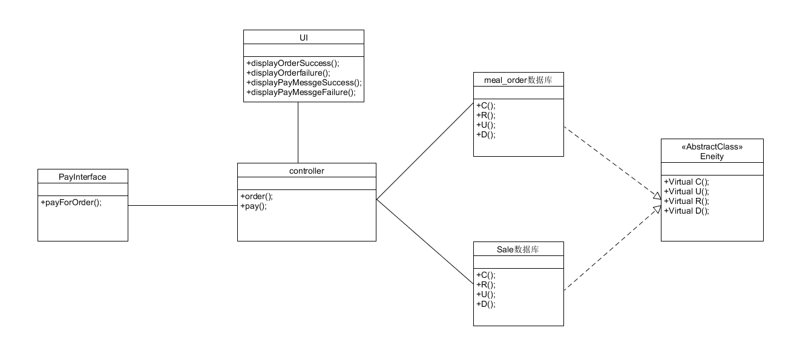
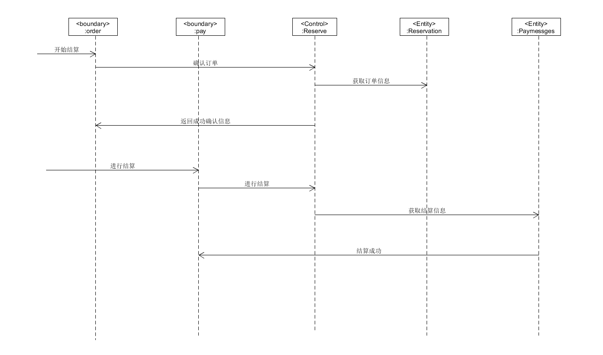

## 用例简介:
- 用户在完成订单后，进行结算的用例功能
- Bounder类：
    - Pay：支付的类
    - Order：确认订单的类
- Control类:
    - Reserve：处理外部事件，实现控制流的类
- Entity类:
    - Reservation：订单信息 
    - Paymessges：支付信息

## ECB类图：

## ECB顺序图：

