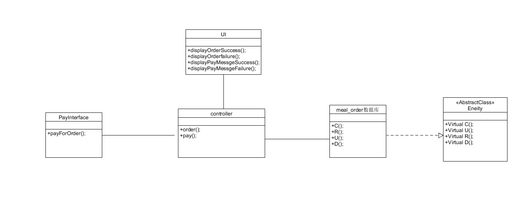
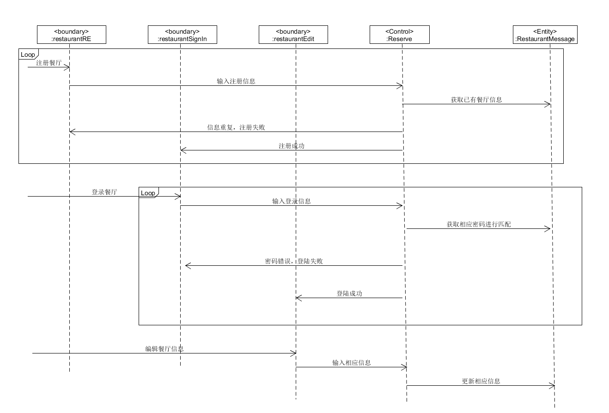

## 用例简介:
- 餐厅管理者登入系统编辑餐厅信息
- Bounder类：
    - RestaurantRE：注册饭店的类
    - RestaurantSignIN：登录饭店的类
    - Restaurantedit：编辑饭店的类
- Control类:
    - Reserve：处理外部事件，实现控制流的类
- Entity类:
    - RestaurantMessage：饭店信息 

## ECB类图：

## ECB顺序图：

