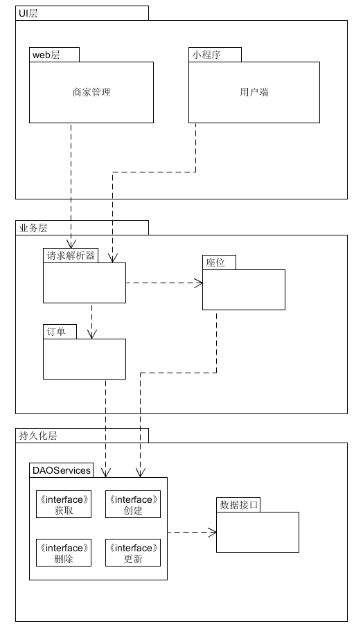
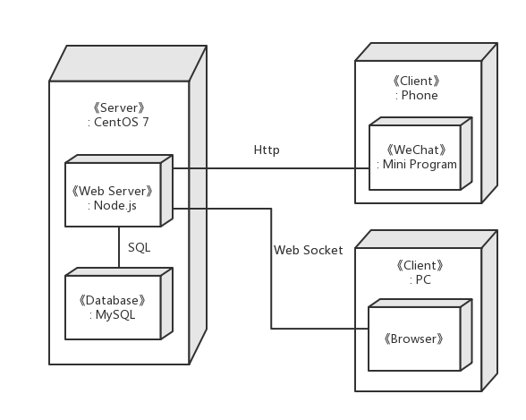

# 软件架构文档：Zhidan项目

<!-- TOC depthFrom:2 -->

## 一、简介：架构表示

​	本文档是Zhidan项目的架构文档，Zhidan是一个扫码点餐的餐厅订单管理平台。我们将在文档中用一系列视图表示我们的软件项目架构：逻辑视图、物理视图。下面的视图介绍将采用UML图的形式进行介绍。

 

## 二、架构决策（技术备忘录）

### 2.1 问题：微信端用户状态如何保存

- **因素**

微信端提供给网页的相关第三方接口

- **解决方案**

通过微信官方API文档

>  **微信网页授权，获取用户的微信官方API文档地址：**
>
> <http://mp.weixin.qq.com/wiki/17/c0f37d5704f0b64713d5d2c37b468d75.html>

- **动机**

食客一般点餐后希望能够查看到自己的订单，以确认下单成功，同时还能检查所点菜品与实际上菜单是否符合。完善用户体验。

- **未决问题**：无

- **其他可供选择的解决方案**：无

 

### 2.2 问题：订单响应的实时性

- **因素**

同一时段下单流量的大小、网络带宽等

- **解决方案**

使用websocket机制，使得PC端与服务器建立连接，实时获取订单信息

- **动机**

餐厅希望能够在顾客下单后的第一时间获取订单信息，以确保餐厅与顾客之间业务同步

- **未决问题：**无

- **其他可供选择的解决方案**：无

 

### 2.3 问题：可部署性

- **因素**

项目总体架构的复杂度

- **解决方案**

通过docker容器技术使得生产环境可以迅速迁移

- **动机**

在餐厅账户不断增长后，我们可能需要部署分布式应用，在多个容器下部署相同的生产环境，使得流量负载均衡

- **未决问题**：无

- **其他可供选择的解决方案**：无

 

## 三、逻辑视图

## 四、物理视图

