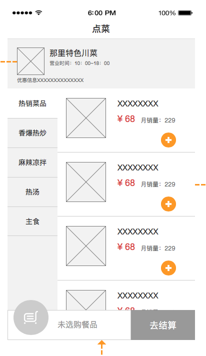
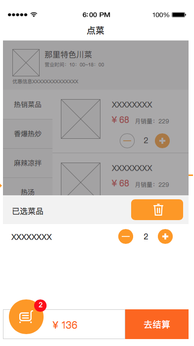
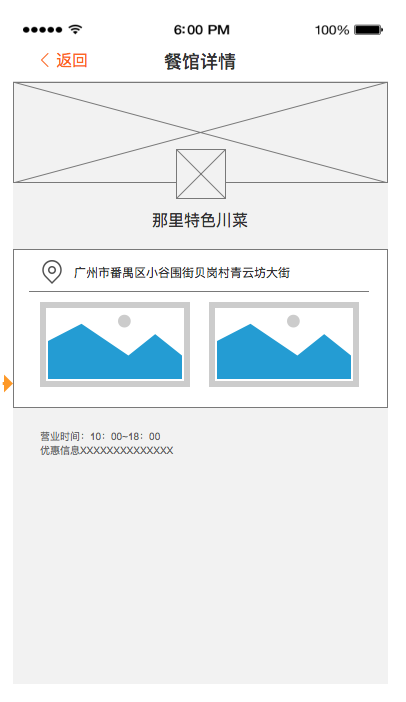

# UI设计

> UI设计1.0

## 1. 单界面设计

### 1.1 移动端UI

| 1. 移动端-菜单1                                              | 2. 移动端-菜单2                                              | 3. 移动端-购物车                                             |
| ------------------------------------------------------------ | ------------------------------------------------------------ | ------------------------------------------------------------ |
|  |  |  |
|                                                              |                                                              |                                                              |
| 4. 移动端-餐厅详情                                           | 5. 移动端-订单                                               | ----                                                         |
|  |  | ----                                                         |
|                                                              |                                                              |                                                              |
| 6. 移动端-支付确认                                           | 7. 移动端-已支付                                             | 8. 移动端-支付失败                                           |
|  |  |  |

### 1.2 PC端界面

>  TODO

 

## 2. 交互设计

- [交互设计](../../assets/images/Single-Page-UI/UI交互1.0.png)

