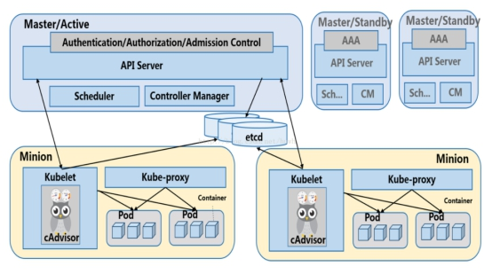
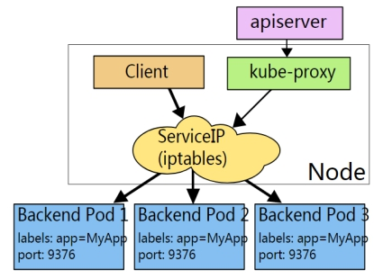
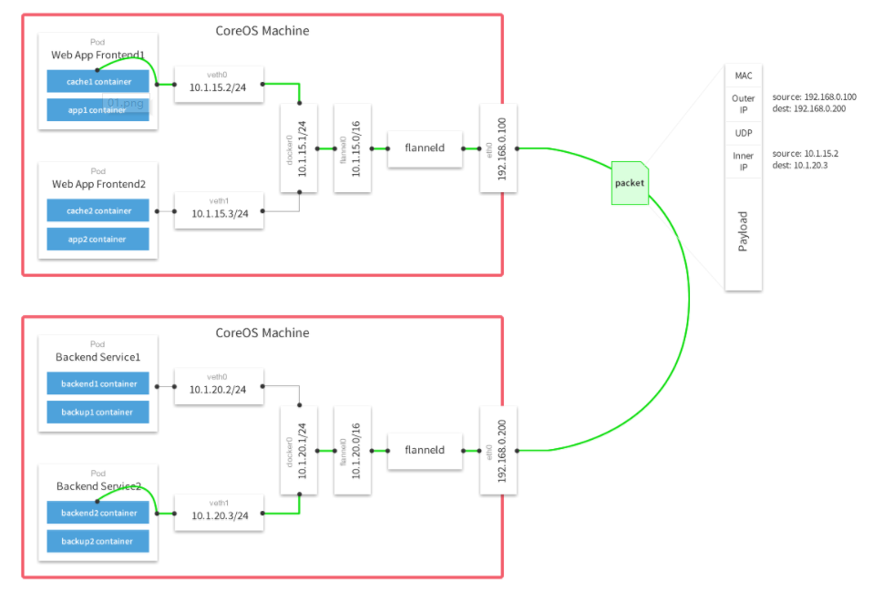

**一、Kubernetes介绍**
&nbsp;&nbsp;&nbsp;&nbsp;&nbsp;&nbsp;Kubernetes是一款应用于集群的，容器自动部署、扩展和管理的开源平台，提供了一种以容器为中心的基础架构。
利用kubernetes，你可以快速高效地响应客户如下请求： 
&nbsp;&nbsp;* 应用程序的动态、精准部署 
&nbsp;&nbsp;* 应用程序的动态扩展 
&nbsp;&nbsp;* 无缝推出新功能 
&nbsp;&nbsp;* 按需优化使用硬件资源
kubernetes是：
&nbsp;&nbsp;&nbsp;&nbsp;便携的：公有云、私有云、混合云、多云
&nbsp;&nbsp;&nbsp;&nbsp;可扩展的：模块化、即插即用、钩子化、组合化
&nbsp;&nbsp;&nbsp;&nbsp;自动修复的：自动布局、自动重启、自动副本、自动伸缩
（1） **总体架构**

 
&nbsp;&nbsp;主体有三大部分：master，etcd和node
&nbsp;&nbsp;每个master包括：APIServer，Scheduler，Colltroller Manager（CM）
&nbsp;&nbsp;每个node（Minion）包括：Kubelet，Kube-proxy，Pod
&nbsp;&nbsp;Etcd是基于Raft算法的高可用键值存储系统。
 
**控制流程**：&nbsp;kubecfg进行特定请求（创建，访问资源对象）
&nbsp;&nbsp;&nbsp;&nbsp;->Client把请求发到APIServer
&nbsp;&nbsp;&nbsp;&nbsp;->APIServer根据请求的资源类型选择对应的REST Storage API处理请求
&nbsp;&nbsp;&nbsp;&nbsp;->将处理结果存入高可用键值存储系统Etcd中
&nbsp;&nbsp;&nbsp;&nbsp;->APIServer相应请求后，Scheduler会从Client获取信息并将未分发的pod分发到可用的node上。
 
**APIServer：**
资源的唯一入口：
&nbsp;&nbsp;1. 只有API Server与存储通信
&nbsp;&nbsp;2. 其他模块通过API Server访问集群状态。
原因： 
&nbsp;&nbsp;1.为了保证集群状态访问的安全。
&nbsp;&nbsp;2.为了隔离集群状态访问的方式和后端存储实现的方式
**CM：**实现集群故障检测和恢复的自动化工作，负责执行各种控制器：
&nbsp;&nbsp;&nbsp;&nbsp;endpoint-controller：定期关联service和pod(关联信息由endpoint对象维护)，保证service到pod的映射总是最新的。
&nbsp;&nbsp;&nbsp;&nbsp;replication-controller：定期关联replicationController和pod，保证replicationController定义的复制数量与实际运行pod的数量总是一致的。
 
**Scheduler**
&nbsp;&nbsp;&nbsp;&nbsp;Scheduler收集和分析当前Kubernetes集群中所有Minion节点的资源(内存、CPU)负载情况，然后依此分发新建的Pod到Kubernetes集群中可用的节点。
&nbsp;&nbsp;&nbsp;&nbsp;实时监测Kubernetes集群中未分发和已分发的所有运行的Pod。
&nbsp;&nbsp;&nbsp;&nbsp;Scheduler也监测Minion节点信息（资源），由于会频繁查找Minion节点，Scheduler会缓存一份最新的信息在本地。
&nbsp;&nbsp;&nbsp;&nbsp;最后，Scheduler在分发Pod到指定的Minion节点后，会把Pod相关的信息Binding写回API Server。

**Kubelet**
1. 负责Node节点上pod的创建、修改、监控、删除等全生命周期的管理
2. 定时上报本Node的状态信息给API Server。
3. kubelet是API Server和Minion之间的桥梁，接收API Server分配给它的commands和work，与持久性键值存储etcd、file、server和http进行交互，读取配置信息。
4. 具体：
&nbsp;&nbsp;&nbsp;&nbsp;设置容器的环境变量、给容器绑定Volume、给容器绑定Port、根据指定的Pod运行一个单一容器、给指定的Pod创建network 容器。
&nbsp;&nbsp;&nbsp;&nbsp;同步Pod的状态、同步Pod的状态、从cAdvisor获取Container info、 pod info、 root info、 machine info。
&nbsp;&nbsp;&nbsp;&nbsp;在容器中运行命令、杀死容器、删除Pod的所有容器。
 
**Proxy（实现service的一个主要部件）**
&nbsp;&nbsp;&nbsp;&nbsp;1. Proxy是为了解决外部网络能够访问跨机器集群中容器提供的应用服务而设计的，运行在每个Node上。Proxy提供TCP/UDP sockets的proxy，每创建一种Service，Proxy主要从etcd获取Services和Endpoints的配置信息（也可以从file获取），然后根据配置信息在Minion上启动一个Proxy的进程并监听相应的服务端口，当外部请求发生时，Proxy会根据Load Balancer将请求分发到后端正确的容器处理。
&nbsp;&nbsp;&nbsp;&nbsp;2. Proxy不但解决了同一主宿机相同服务端口冲突的问题，还提供了Service转发服务端口对外提供服务的能力，Proxy后端使用了随机、轮循负载均衡算法。
 
**Kubectl**
通过客户端的kubectl命令集操作，API Server响应对应的命令结果，从而达到对kubernetes集群的管理。
 
（2） 主要对象
**Deployment**：用来创建ReplicaSet，RS在后台创建并且维持pod数目，当template中镜像或者label更新时会执行rollout创建新版本的RS，旧版本被更替并且保存，可以进行版本的回滚以及管理。
**Statefulset**：statefulset创建时并没有创建ReplicaSets。除此之外，deployment和statefulset创建的pod在命名上也有很大的不同，statefulset的pod都是statefulset的name-#，其中#是0,1,2...有序的，而 deployment的是deployment的name-str，str是一个随机字符串，没有规则。删除后新建的pod名字一样并且域名一样（ip不一样），deployment创建的不一样。
**Keepalived**：不是k8s部件（了解），检测服务器的状态，如果有一台web服务器宕机，或工作出现故障，Keepalived将检测到，并将有故障的服务器从系统中剔除，同时使用其他服务器代替该服务器的工作，当服务器工作正常后Keepalived自动将服务器加入到服务器群中。在网络层，通过是否ping通检测，传输层是通过特定端口是否有回应，应用层上根据用户的设定检查服务器相应服务是否运行正常。
**cAdvisor**：是一个运行时的守护进程，负责收集、聚合、处理和输出运行中容器的信息
**ZooKeaper**：一个利用Zab协议为分布式应用提供一致性服务的软件。Raft算法和Zab协议类似，提供了一致性保证，保证了存储的高可用性。
**Service**：每个服务有vip，与多个pod（后端）关联，通过iptable代理模式把服务的访问请求负载均衡到适合的后端。通过apiService让kube-proxy设置相应的iptable映射规则，然后客户端访问的vip+端口对经过iptables进行NAT映射到对应的后端pod。也可以用NodePort类型把服务绑定到node的端口。主机访问ip都先查看路由表再经过iptable.

**二、运行于Kubernetes上的知单**
Kubernetes对容器的强大自动化管理功能吸引了各大企业的注意。
当然，即使我们这个小小的应用服务也能使用Kubernetes进行管理：
**1.yaml文件：**
（1）namespace.yaml
文件名：zhidan.namespace.yaml

    apiVersion: v1
    kind: Namespace
    metadata:
      name: zhidan

**（2）deployment.yaml**
前端服务我们用web来表示，后台服务用server表示。我们都启动两个副本来保证服务的高可用性
文件名：zhidan.deploy.web.yaml

    apiVersion: extensions/v1beta1
    kind: Deployment
    metadata:
      #名字规范 模块名-deploy-模块内微服务名
      name: zhidan-deploy-web
      #命名空间规范 模块名
      namespace: zhidan
      # these labels can be applied automatically
      # from the labels in the pod template if not set
    spec:
      replicas: 2
      strategy:
        rollingUpdate:
          maxSurge: 1      #滚动升级时会先启动1个pod
          maxUnavailable: 1 #滚动升级时允许的最大Unavailable的pod个数
      # selector can be applied automatically
      # from the labels in the pod template if not set
      template:
        metadata:
          labels:
            #规范： module为模块名 app为微服务名 tier 为角色 请根据实际填写，比如 mysql主从的master slave等
            module: zhidan
            app: web
        spec:
    #      terminationGracePeriodSeconds: 60 #k8s将会给应用发送SIGTERM信号，可以用来正确、优雅地关闭应用,默认为30秒
    #      nodeSelector:
    #        node_name: node1
          containers:
          #规范： 模块名-微服务名-自定义名-container
          - name: zhidan-web-container
            image: mydocker.io:5000/zhidan-web:0.1
            volumeMounts:
            #规范：volume-开头，后面根据用途填写
            - name: volume-web-log
              mountPath: /data/web
            resources:
              #requests用于调度判断，最小资源需求。 cpu100m 为0.1核
              requests:
                cpu: 300m
                memory: 500Mi
              #limits 容器可以短暂超过该限制，如果长时间超过可能会被kill掉并调度到资源更充足的node上
              limits:
                cpu: 1000m
                memory: 1000Mi
            ports:
            - containerPort: 80
            readinessProbe: #kubernetes认为该pod是启动成功的
              tcpSocket:
                port: 80
              initialDelaySeconds: 60
              periodSeconds: 5
              timeoutSeconds: 3
              successThreshold: 1
              failureThreshold: 5
            livenessProbe: #kubernetes认为该pod是存活的,不存活则需要重启
              tcpSocket:
                port: 80
              initialDelaySeconds: 60
              periodSeconds: 5
              timeoutSeconds: 5
              successThreshold: 1
              failureThreshold: 3
          volumes:
            - name: volume-web-log
              hostPath:
                path: /data/k8s/log/zhidan/zhidan.deploy.web
    

文件名：zhidan.deploy.server.yaml

    apiVersion: extensions/v1beta1
    kind: Deployment
    metadata:
      #名字规范 模块名-deploy-模块内微服务名
      name: zhidan-deploy-server
      #命名空间规范 模块名
      namespace: zhidan
      # these labels can be applied automatically
      # from the labels in the pod template if not set
    spec:
      replicas: 2
      strategy:
        rollingUpdate:
          maxSurge: 1      #滚动升级时会先启动1个pod
          maxUnavailable: 1 #滚动升级时允许的最大Unavailable的pod个数
      # selector can be applied automatically
      # from the labels in the pod template if not set
      template:
        metadata:
          labels:
            #规范： module为模块名 app为微服务名 tier 为角色 请根据实际填写，比如 mysql主从的master slave等
            module: zhidan
            app: server
        spec:
    **#      terminationGracePeriodSeconds: 60** #k8s将会给应用发送SIGTERM信号，可以用来正确、优雅地关闭应用,默认为30秒
    #      nodeSelector:
    #        node_name: node1
          containers:
          #规范： 模块名-微服务名-自定义名-container
          - name: zhidan-server-container
            image: mydocker.io:5000/zhidan-server:0.1
            volumeMounts:
            #规范：volume-开头，后面根据用途填写
            - name: volume-server-log
              mountPath: /data/server
            resources:
              #requests用于调度判断，最小资源需求。 cpu100m 为0.1核
              requests:
                cpu: 300m
                memory: 500Mi
              #limits 容器可以短暂超过该限制，如果长时间超过可能会被kill掉并调度到资源更充足的node上
              limits:
                cpu: 1000m
                memory: 1000Mi
            ports:
            - containerPort: 80
            readinessProbe: #kubernetes认为该pod是启动成功的
              tcpSocket:
                port: 80
              initialDelaySeconds: 60
              periodSeconds: 5
              timeoutSeconds: 3
              successThreshold: 1
              failureThreshold: 5
            livenessProbe: #kubernetes认为该pod是存活的,不存活则需要重启
              tcpSocket:
                port: 80
              initialDelaySeconds: 60
              periodSeconds: 5
              timeoutSeconds: 5
              successThreshold: 1
              failureThreshold: 3
          volumes:
            - name: volume-server-log
              hostPath:
                path: /data/k8s/log/zhidan/zhidan.deploy.server

**（3）service.yaml**
文件名：zhidan.svc.web.yaml

    apiVersion: v1
    kind: Service
    #集群内可以通过zhidan-web.zhidan:8010来访问前端服务
    metadata:
      name: zhidan-web
      namespace: zhidan
    spec:
      #可以指定ip:8010来访问前端服务
      clusterIP: 192.168.192.72
      #集群内开放服务的8010端口
      ports:
      - name: web-port
        port: 8010
        targetPort: 8010
        nodeport: 8010
      selector:
        module: zhidan
        app: web
      #选中label符合要求的pod作为服务的rs

文件名：zhidan.svc.server.yaml

    apiVersion: v1
    kind: Service
    #集群内可以通过zhidan-server.zhidan:3000来访问前端服务
    metadata:
      name: zhidan-server
      namespace: zhidan
    spec:
      #可以指定ip:3000来访问前端服务
      clusterIP: 192.168.192.73
      #集群内开放服务的3000端口
      ports:
      - name: server-port
        port: 3000
        targetPort: 3000
      selector:
        module: zhidan
        app: server
      #选中label符合要求的pod作为服务的rs

**2.命令执行**
在master上执行命令：

    #创建namespace
        kubectl create -f ./zhidan.namespace.yaml
    #创建deployment
        kubectl create -f ./zhidan.deploy.server.yaml
        kubectl create -f ./zhidan.deploy.web.yaml
    #创建service
        kubectl create -f ./zhidan.svc.server.yaml
        kubectl create -f ./zhidan.svc.web.yaml

**三、关键技术实现**
&nbsp;&nbsp;&nbsp;&nbsp;集群内的容器间网络的实现是个大问题，官方的k8s没有提供官方的容器间网络实现方法。比较受欢迎的两种开源技术是calico和flannel。

由于flannel的稳定性更强，我们选择使用flannel来实现。

flannel原理如图：

&nbsp;&nbsp;&nbsp;&nbsp;原始数据是在起始节点的Flannel服务上进行UDP封装的，投递到目的节点后就被另一端的Flannel服务还原成了原始的数据包，两边的Docker服务都感觉不到这个过程的存在。
&nbsp;&nbsp;&nbsp;&nbsp;如何实现所有容器唯一ip？每个节点上的docker容器使用不同的地址段。如何设置的：
    &nbsp;&nbsp;&nbsp;&nbsp;因为Flannel通过Etcd分配了每个节点可用的IP地址段后，修改了Docker的启动参数,“--bip=172.17.18.1/24”这个参数，它限制了所在节点容器获得的IP范围。
  &nbsp;&nbsp;&nbsp;&nbsp;发送到其他node的都会路由到flannel0接口。

