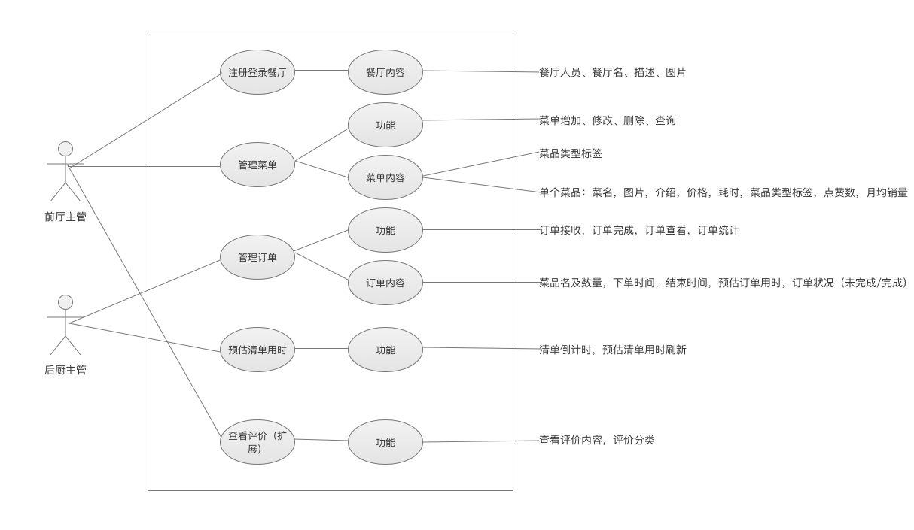
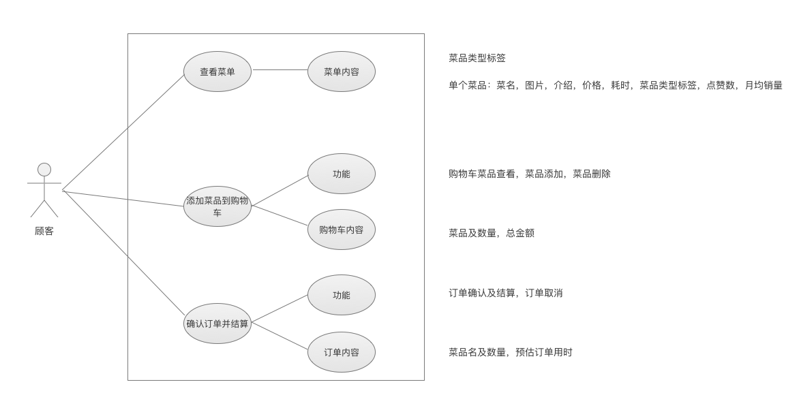

# Software Requirement Specification

>  软件规格说明书

[TOC]

## 1. 引言

### 1.1 编写目的 

​	编写此文档的目的是进一步定制软件开发的细节问题，便于用户与开发商协调工作，本文档面向的读者主要是项目委托单位的管理人员，希望能使本软件开发工作更具体 

### 1.2 项目背景 

​	手机支付逐渐成为当下餐饮业的主流，节省了现金支付的繁琐过程。

​	手机支付节省了一定的时间，但传统的点餐过程仍旧是繁琐的，食客进入小型的餐厅中点餐，服务员引导，客户下单，服务员传递订单到后厨；这一系列过程都是需要一个服务员为顾客进行一对一的服务的，在一些小型餐厅中人手不足，在面对许多顾客的点餐时会出现人手不足等问题，甚至被因此被客户评价服务差。对于客户这样的点餐体验无疑是繁琐而又不足的（特别是服务员不足的情况），对于商家这样的过程需要多余的人力成本，并且耗费的中间时间过多。

​	为了解决上述问题，我们为商家提供一个点餐平台，提供一套从用户点餐到后厨接单的在线服务系统。

## 2. 需求概述

### 2.1 目标系统

1. 餐厅信息管理系统
2. 菜单系统
3. 点餐系统
4. 结算系统
5. 订单系统

### 2.2 服务对象

1. 餐厅食客
2. 餐厅管理者

### 2.3 运行环境

1. 商家端：PC端浏览器
2. 客户端：移动端微信

### 2.4 条件与限制

1. 有线环境

## 3. 系统功能需求

### 3.1 商家端

#### 3.1.1 商家端功能

1. 注册登录餐厅（核心）
    - **餐厅内容**：
      - 餐厅所有人，餐厅名，描述，图片
2. 管理菜单（核心）
    - **功能**：菜单添加，修改，删除，查询
    - **菜单内容**：
      - 菜品类型标签
      - 单个菜品：菜名，图片，介绍，价格，耗时，菜品类型标签，点赞数，月均销量
3. 管理订单（核心）
      - **功能**：订单接收，订单完成，订单查看，订单统计
      - **订单内容**：菜品名及数量，下单时间，结束时间，预估订单用时，订单状况（未完成/完成）
4. 计算预估清单用时（扩展）
      - **功能**：清单倒计时，预估清单用时刷新
5. 查看评价（扩展）
    - **功能**：查看评价内容，评价分类

#### 3.1.2 商户端用例图

### 3.2 客户端

#### 3.2.1 客户端功能

1. 查看菜单
    - **菜单内容**：
      - 菜品类型标签
      - 单个菜品：菜名，图片，介绍，价格，耗时，菜品类型标签，点赞数，月均销量
2. 添加菜单到拟订单
    - **功能**：拟订单菜品查看，菜品添加，菜品删除
    - **拟订单内容**：菜品及数量，总金额
3. 确认订单，并结算
    - **功能**：拟订单确认及结算，拟订单取消
    - **订单内容**：菜品名及数量，预估订单用时

#### 3.2.2 客户端用例图

