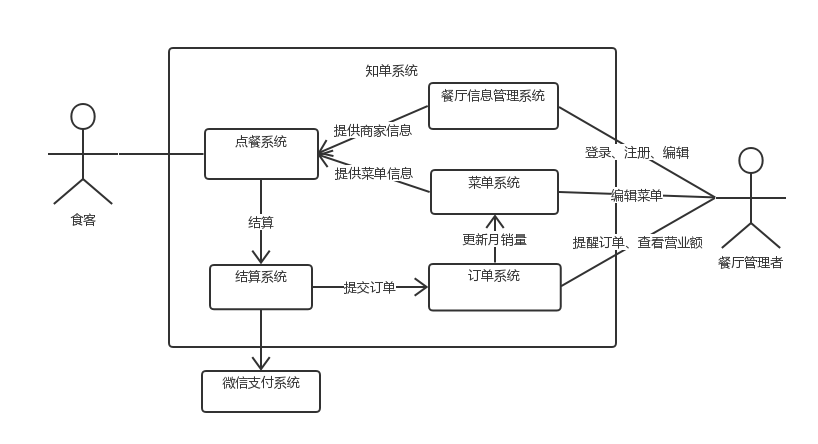
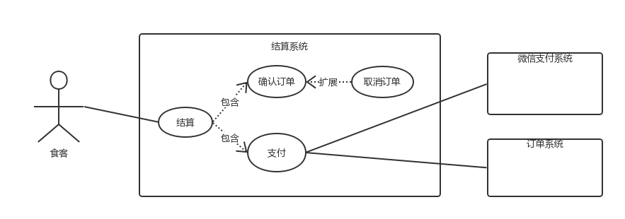
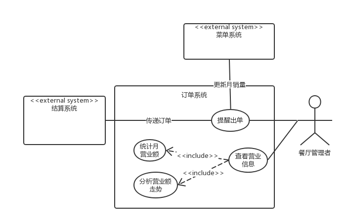
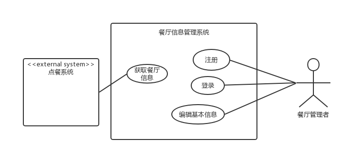

# Software Requirement Specification

>  软件规格说明书

[TOC]

## 1. 引言

### 1.1 编写目的 

​	编写此文档的目的是进一步定制软件开发的细节问题，便于用户与开发商协调工作，本文档面向的读者主要是项目委托单位的管理人员，希望能使本软件开发工作更具体 

### 1.2 项目背景 

​	手机支付逐渐成为当下餐饮业的主流，节省了现金支付的繁琐过程。

​	手机支付节省了一定的时间，但传统的点餐过程仍旧是繁琐的，食客进入小型的餐厅中点餐，服务员引导，客户下单，服务员传递订单到后厨；这一系列过程都是需要一个服务员为顾客进行一对一的服务的，在一些小型餐厅中人手不足，在面对许多顾客的点餐时会出现人手不足等问题，甚至被因此被客户评价服务差。对于客户这样的点餐体验无疑是繁琐而又不足的（特别是服务员不足的情况），对于商家这样的过程需要多余的人力成本，并且耗费的中间时间过多。

​	为了解决上述问题，我们为商家提供一个点餐平台，提供一套从用户点餐到后厨接单的在线服务系统。

## 2. 需求概述

### 2.1 目标系统

1. 餐厅信息管理系统
2. 菜单系统
3. 点餐系统
4. 结算系统
5. 订单系统

### 2.2 服务对象

1. 餐厅食客
2. 餐厅管理者

### 2.3 运行环境

1. 商家端：PC端浏览器
2. 客户端：移动端微信

### 2.4 条件与限制

1. 有线环境

## 3. 系统功能需求

### 3.1 商家端

#### 3.1.1 商家端功能

1. **注册登录餐厅（核心）**
    - **餐厅内容**：
      - 餐厅所有人，餐厅名，描述，图片
2. **管理菜单（核心）**
    - **功能**：菜单添加，修改，删除，查询
    - **菜单内容**：
      - 菜品类型标签
      - 单个菜品：菜名，图片，介绍，价格，耗时，菜品类型标签，点赞数，月均销量
3. **管理订单（核心）**
      - **功能**：订单接收，订单完成，订单查看，订单统计
      - **订单内容**：菜品名及数量，下单时间，结束时间，预估订单用时，订单状况（未完成/完成）
4. **计算预估清单用时（扩展）**
      - **功能**：清单倒计时，预估清单用时刷新
5. **查看评价（扩展）**
    - **功能**：查看评价内容，评价分类

### 3.2 客户端

#### 3.2.1 客户端功能

1. **查看菜单**
    - **菜单内容**：
      - 菜品类型标签
      - 单个菜品：菜名，图片，介绍，价格，耗时，菜品类型标签，点赞数，月均销量
2. **添加菜单到购物车**
    - **功能**：购物车菜品查看，菜品添加，菜品删除
    - **拟订单内容**：菜品及数量，总金额
3. **确认订单，并结算**
    - **功能**：购物车生成订单确认及结算，拟订单取消
    - **订单内容**：菜品名及数量，预估订单用时

## 4. 系统用例

### 4.1 系统逻辑关系图

### 4.2 点餐系统

>  **点餐用例图**

> casual用例

#### 用例1：查看餐厅信息

- **主要参与者**：顾客
- **目标**：顾客可以通过移动客户端浏览餐厅信息
- **概览**：顾客到达餐厅并选择餐桌就座，然后通过移动客户端，进入餐厅主页，浏览餐厅的基本信息。
- **类型**：用户目标级别
- **主成功场景**：
  1. 顾客到达餐厅，并选择餐桌就座。
  2. 顾客通过餐桌上的商家标识，运用自己的移动设备，获取餐厅的基本信息主页。

- **交替场景**：

   1. 如果餐厅的餐桌上没有提供商家的二维码或其他标识，顾客需要换张桌子或询问餐厅的服务员。

   2. 如果顾客获取餐厅信息失败，则告知用户刷新页面，重新进入。

   3. 如果顾客多次获取餐厅信息均失败，则告知用户可能是因为网络阻塞等原因而无法访问，并提示用户可以询问餐厅服务员。

#### 用例2：浏览菜品

- **主要参与者**：顾客

- **目标**：顾客可以通过移动客户端浏览餐厅的菜单

- **概览**：顾客通过餐厅主页上的“菜单”链接，进入到菜单列表并浏览菜单信息。

- **类型**：用户目标级别

- **主成功场景**：  

    1. 顾客点击餐厅主页上的“菜单”链接，进入餐厅的菜单列表，列表上包含菜品的图片以及售价等基本信息。
    2. 顾客上下滑动菜单列表，浏览菜单信息。
    3. 顾客点击列表上的菜品，显示菜品的详细信息（如材料，配菜，口味等）

- **交替场景**：

   1. 如果顾客获取餐厅菜单失败，则告知用户刷新页面，重新进入。

   2. 如果顾客多次获取餐厅菜单均失败，则告知用户可能是因为网络阻塞等原因而无法访问，并提示用户可以询问餐厅服务员。

   3. 如果菜品的图片缺失或加载失败，则在菜单中显示默认图片。

#### 用例3：添加菜品

**主要参与者**：顾客

**目标**：顾客可以在菜单列表中向其订单中添加菜品

**概览**：顾客通过点击菜单列表中的“添加”按钮，将该菜品添加到自己的订单里。

**类型**：用户目标级别

**主成功场景**：

1. 顾客点击菜单列表中的“添加”按钮，对应的菜品就会自动添加到顾客的订单中，同时更新订单金额。

**交替场景**：

   1.1 如果顾客多次添加同一菜品，则不重复往顾客订单里添加，而是更改顾客订单中该菜品的数量

   1.2 如果顾客所要添加的菜品已售罄，则用户添加该菜品的操作无效，并提示用户该菜品已售罄，请选择其他在售的菜品

#### 用例4：移除菜品

**主要参与者**：顾客

**目标**：顾客可以从其订单中移除菜品

**概览**：顾客通过点击菜单列表中的“移除”按钮，将该菜品从自己的订单里移除。

**类型**：用户目标级别

**主成功场景**：

1. 顾客点击菜单列表中或订单内容中的“移除”按钮，对应的菜品就会自动从顾客的订单中移除掉，同时更新订单金额。

**交替场景**：

   1.1 如果顾客订单中的同一菜品的数量大于1，则不直接从顾客订单里移除该菜品，而是更改顾客订单中该菜品的数量

#### 用例5：结算

**主要参与者**：顾客

**目标**：顾客完成点餐过程并确认所点的菜品

**概览**：顾客点餐完成并确认后，通过点击菜单列表中的“结算”按钮，以进行之后的订单提交和支付。

**类型**：用户目标级别

**主成功场景**：

1. 顾客完成菜品选择，选择“结算”提交订单
2. 系统询问顾客是否确认所选菜品信息无需更改
3. 顾客确认订单，则订单传送到结算系统
4. 顾客点餐完成，等待结算系统处理订单

**交替场景**：

   2.1 如果顾客需要更改选择的菜品信息，则取消顾客此次的结算操作，用户可以继续添加或者移除菜品。

   3.1 如果系统检测到与外部结算系统通信失败，则告知用户发生错误位置，提示用户重新进行操作。

### 4.3 结算系统

- 用例图

> full用例

| 要素                 | 内容                                                         |
| -------------------- | ------------------------------------------------------------ |
| **用例名称**         | 结算系统                                                     |
| **范围**             | 知单订单结算应用                                             |
| **级别**             | 用户目标                                                     |
| **主要参与者**       | 食客                                                         |
| **涉及及其关注点**   | 食客：希望能更快时间结算订单。   食客：希望能按自己意愿轻松取消订单。   餐厅管理者：希望能够及时快速的把取消订单通知以及结算信息传递。  餐厅管理者：希望能够保存订单取消理由和支付数据以便进行后续分析。   |
| **前置条件**         | 食客必须授权结算系统支付功能。                               |
| **成功保证**         | 准确及时地完成订单结算。  及时收到支付信息和订单取消的通知。 |
| **主成功场景**       | 1. 食客进入结算系统，发现两个主要选择，一个是取消订单以及取消理由选择，还有一个是支付，能成功调用微信支付。   2. 结算系统及时把订单结算信息以及取消信息发到订单系统。  3. 订单系统能收到各种订单信息。  4. 至此，结算系统的一次使用完毕 |
| **扩展**             | 餐厅管理者在发现订单数据有异常时应可以对此提出疑问，便立刻向后端进行同步数据。 |
| **特殊需求**         | 应支持多国语言                                               |
| **技术和数据变元素** | 登录结算系统，进行支付操作时，需要认证（指纹或者密码）       |
| **发生频率**         | 经常发生                                                     |
| **杂项**             | UI要做的简洁易懂                                             |

### 4.4 订单系统

- 用例图

> full用例

| 要素                 | 内容                                                         |
| -------------------- | ------------------------------------------------------------ |
| **用例名称**         | 结算系统                                                     |
| **范围**             | 知单订单管理应用                                             |
| **级别**             | 用户目标                                                     |
| **主要参与者**       | 餐厅管理者                                                   |
| **涉及及其关注点**   | 餐厅管理者：希望能够准确及时地收到统计好地月营业额。   餐厅管理者：希望能够以较小的误差准确分析营业额的走势。   餐厅管理者：希望能够及时知晓对于菜单系统和结算系统传来的提醒，以便能够提醒出单。 |
| **前置条件**         | 餐厅管理者必须通过确认和认证。                               |
| **成功保证**         | 准确及时地统计月营业额。  正确并以较小误差地分析出营业额走势  及时收到菜单系统和结算系统的提醒。 |
| **主成功场景**       | 1. 餐厅管理者进入订单系统，发现两个主要信息，一个是查看营业信息，还有一个便是结算系统和菜单系统反馈给的提醒出单信息。  2. 餐厅管理者进入查看营业信息，发现另外两个功能，一个是统计月营业额，另一个是分析营业额走势。   3. 餐厅管理者想看月营业额为多少，点进去了解了相关月营业额。   4. 餐厅管理者想看想查看未来的营业额走势，便点入分析按钮，观察了一下自己的营业额走势。   5. 餐厅管理者在查看完营业信息的所有内容后，返回场景，便想接着查看订单信息。   6. 在提醒出单中，发现了结算系统和菜单系统发过来的消息，便提醒出单。   7. 至此，餐厅管理者对于订单系统的一次使用完毕。 |
| **扩展**             | 餐厅管理者在发现营业额与自己预想的不符合时，应可以对此提出疑问，便立刻向后端进行同步数据。  餐厅管理者在发现未来营业额走势与自己的预计不符合时，可以提出用系统的算法进行重新评估。  关于提醒出单的服务，任何结算系统和菜单系统反馈过来的信息，订单系统应能及时收到。 |
| **特殊需求**         | 营业额走势应该能用各种图形（例如折线图，柱状图，饼图）表示出来。  应支持多国语言 |
| **技术和数据变元素** | 1. 登录订单系统时，应该只有相应管理员有权进入该系统，即登录订单系统要进行身份认证。 2. 当发现营业额与自己预期不符合时，做出相应的业务调整 |
| **发生频率**         | 不经常发生                                                   |
| **杂项**             | UI要做的美观                                                 |

### 4.6 餐厅信息管理系统

> brief用例

