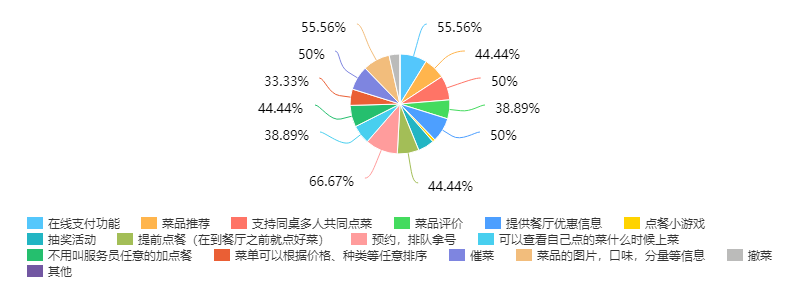

## 关于构建云点餐服务平台的调查报告

- 相关产品与发展综述

​        随着信息时代到来，信息化是餐厅和酒店发展的必然改革之一。现在越来越多的餐厅和酒店开始关注餐饮点菜系统，餐厅和酒店开始使用餐饮点菜软件代替手工管理。而在移动互联网时代的推动下，点菜系统电子化将成为餐厅和酒店在移动互联网时代制胜的砝码之一。

- 值得关注的竞争产品，及其竞争优势

客如云点餐系统：与收银机进行绑定，捆绑用户

鹊桥科技点餐系统：与微信对接，支持微信点餐

- 市场调查结果

传统的点餐过程，从食客进入餐厅到客户点好菜，再到服务员将订单传递到后厨，这一系列步骤较为繁琐，尤其是在一些小型餐厅中，在面对许多顾客的点餐时会出现人手不足等问题，甚至因此被客户评价服务差。随着智能手机的不断普及，打造一个基于移动设备的自助云点餐服务平台的理念也就应运而生。因此，本文也将对如何打造一个用户友好，商家满意的云点餐服务平台进行调查。

本次调查的主体群众的年龄为18-25岁。在我们的调查群体中，有接近90%的受访群众表示愿意使用商家提供的云点餐服务平台，超过80%的受访者表示希望该点餐平台能够使用微信/支付宝的扫一扫功能进入。所以，我们也决定基于web进行点餐平台的开发。

此外，调查显示，有过半的受访者认为市面上现有的点餐平台有需要提供个人信息，如注册，微信授权登录等等，系统卡顿，不稳定等缺点，为提供更好的用户体验，我们也将尽力简化我们的点餐平台的身份认证过程，保障就餐者的隐私，同时也着力于优化系统设计和性能，开发更稳定可靠，更方便快捷的平台。

同时，为提供更好的用户体验，我们也对就餐者希望云点餐平台能够提供的除基本的点餐下单之外的其他功能进行了调查，调查显示，超过50%的受访者希望一个点餐平台还能提供丰富的菜品信息，预约拿号，在线支付的功能。
>>>>>>> dc66636bd8a4cb9585ab03eebe508f9b8f260fa0

- 相关产品的市场（客户）定位

广大需要在餐厅用餐的群众

各大餐馆

- 可能存在的新机遇

点餐过程中可能节省下来的人力物力资源

点餐以及等餐时的用户体验