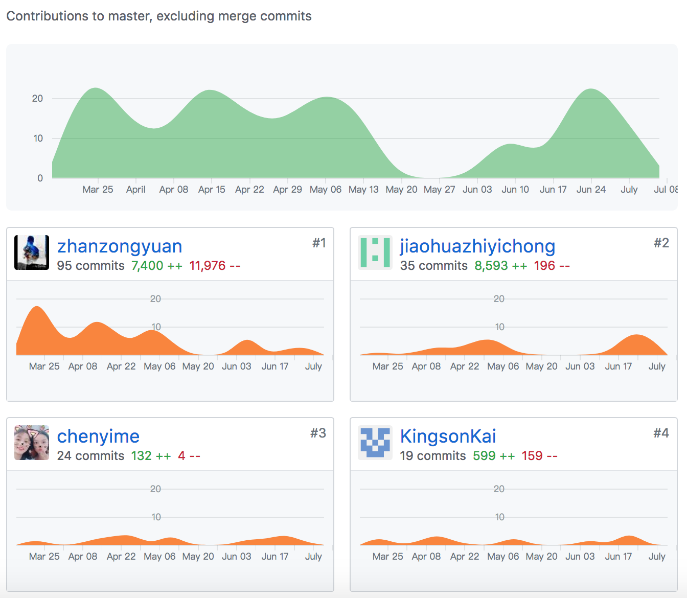
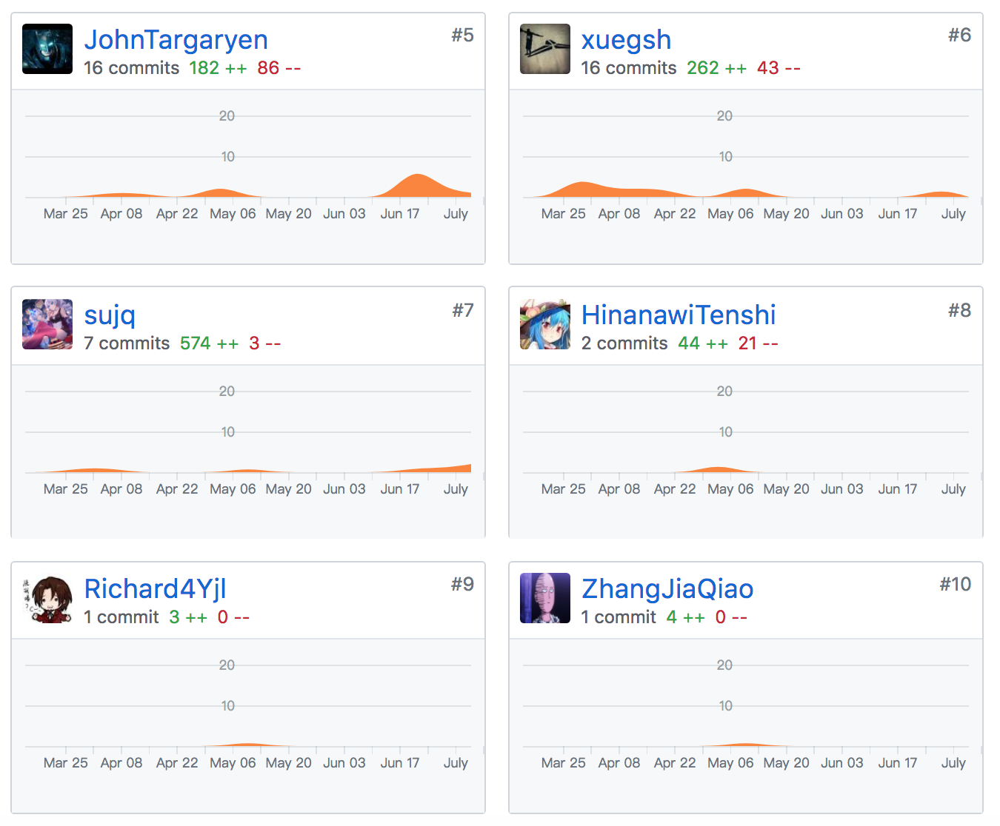
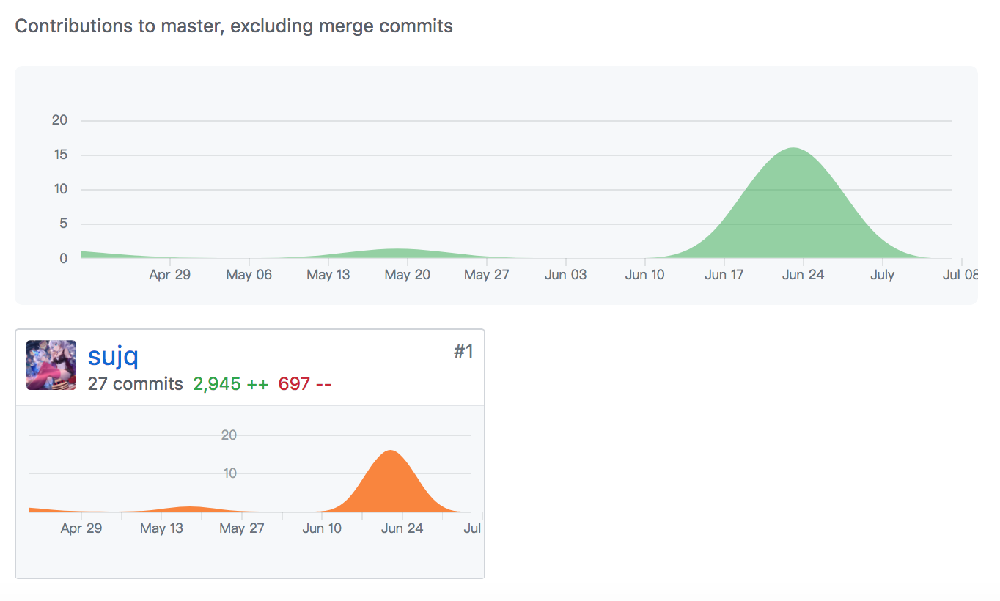
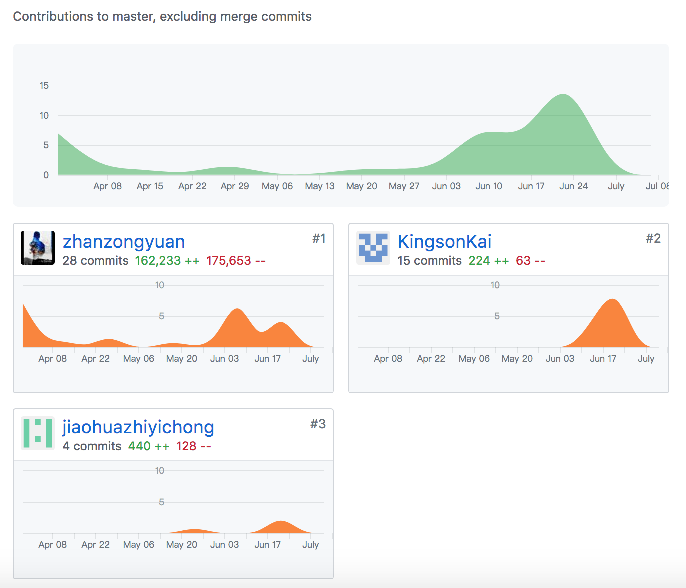
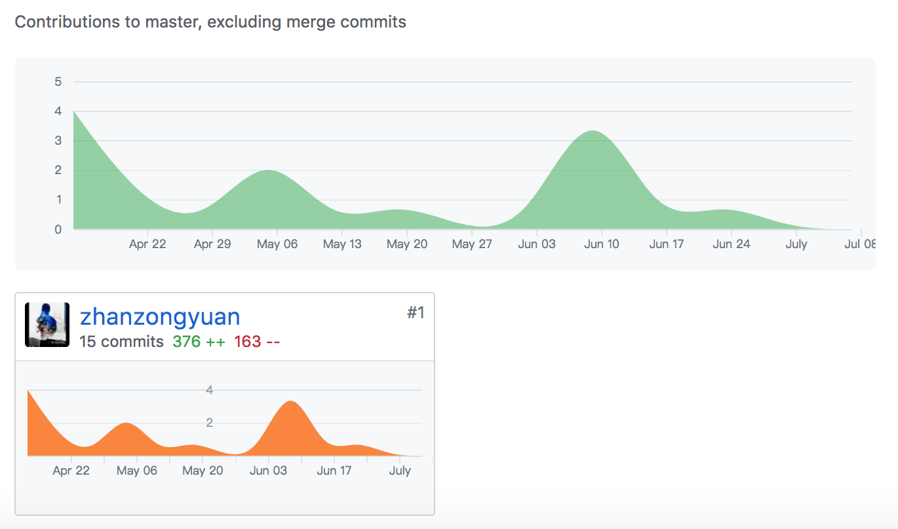
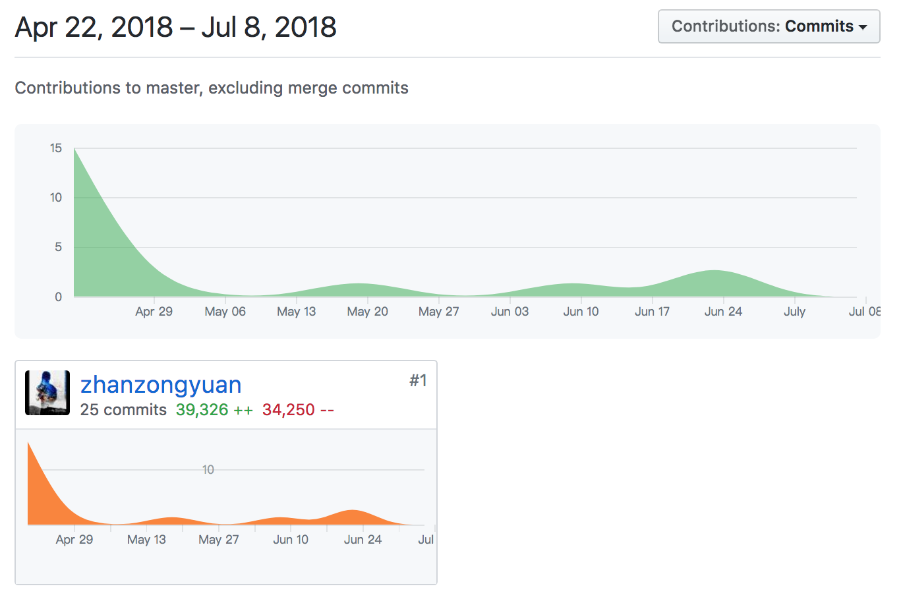

> 小组分工与贡献率说明

| 成员 | 姓名       | 学号     | 分工                   | 贡献率（共计100%） |
| ---- | ---------- | -------- | ---------------------- | ------------------ |
| ZZY  | 沅(第三方) | 15331386 |                        |                    |
| ZK   | 凯         | 15331393 | 服务端功能设计与coding          |     20%               |
| MJR  | 荣         | 15331237 |                        |                    |
| SJQ  | 宿         | 15331333 | UI层移动端设计与coding | 20%                |
| XGS  | 薛         | 15331343 |                        |                    |
| ZC   | 琛        | 15331388 |   服务端统计功能设计与coding,需求规格说明文档编写                     |     20%               |
| CYM  | 枚         | 14313081 | UI设计、交互设计与coding | 18%                   |

> 制品与贡献率

| 制品          | ZZY      (第三方) | ZK   | MJR  | SJQ  | XGS  | ZC   | CYM  |
| ------------- | ----------------- | ---- | ---- | ---- | ---- | ---- | ---- |
| PC-Client     |                   |  0   |      | 0    |      |    0 | 33.33% |
| Mobile-Client |                   |  0   |      | 100% |      |     0 | 0   |
| Web-Server    |                   |  50% |      | 0    |      |   50% | 0   |
| Database      |                   |  0   |      | 0    |      |     0 | 0   |
| 文档          |                   | 15.4%|      | 6%   |      |   35% |6%    |

Dashboard:

Mobile-Client:

PC-Client:

Web-Server:

Database:

API:

