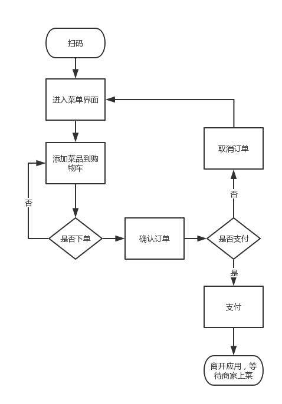
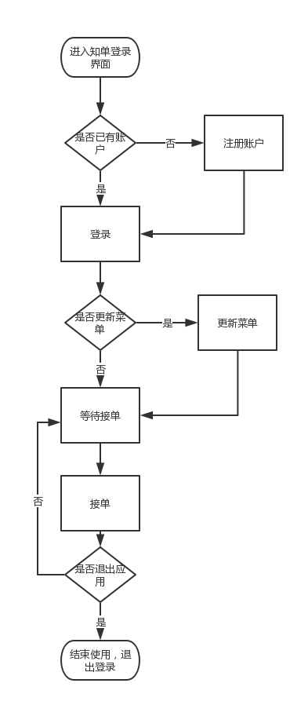

# Vision

> 项目愿景

## 1. 产品描述及流程

- 产品名：知单（Zhidan）
- 客户端描述：即客户在餐厅点餐时，无需到前台点餐或者向服务员告知，扫桌上二维码即可，在弹出来的菜单上选定菜品并结账，即可完成点餐。
- 商家端描述：商家在注册登陆后，可以上传菜品，并且会受到相关各个菜品销售的统计情况，以便更换菜品。商家还会收到相应客户的订单，然后为其备餐和送餐。
- 客户端使用流程如下：

- 商家端使用流程如下：

- 详细需求分析：[软件规格说明书](Software-Requirement-Specification.md)

## 2. 产品目标

1. 提高餐厅前台和后厨的信息互通效率：节约点餐、传递菜单中的人力成本
2. 为餐厅管理提供业务数据可视化服务：将餐厅营业数据可视化，为餐厅规划发展提供数据支持

## 3. 产品价值
- 为广大餐饮行业解决了多人聚餐时的秩序混乱、效率低、耗时等问题。
- 相比线下的反复沟通确认，在线点餐的速度和效率要高出很多。而且这样智能的线上点餐体验，也是餐厅服务品质的重要体现。
- 对餐厅而言，点餐系统不仅满足了顾客的点餐需求，加快点餐速度，同时也能提升餐厅的服务和工作效率。
- 对于一家餐厅来说，用餐高峰期时忙得不可开交是家常便饭，如何在控制成本的前提下提高点餐的效率，一直以来是餐饮企业面临的问题。

## 4. 产品创新点
1. **游戏抽奖活动**：为了更好地和客户进行交流，在客户进行排队等餐时，产品呢为其推出一些丰富多彩的小游戏，参与游戏者有一定机会赢得商家红包，甚至获得免单的机会。
2. **菜品推荐**：根据以往订单，通过给顾客提供个性化的问卷，来计算分析向其推荐菜品。

## 5. 产品潜在竞争对手
- 目前来看市面上存在的竞争对手主要由如下几个：
    1. 淘宝点点APP应用：需要下载特定APP才可投入使用。
    2. 海底捞火锅点餐系统：需要使用特定平板电脑设备才可进行点餐
    3. 电小二点餐系统：国内首家不需要安装APP和相应硬件设备，只需要扫码点餐的系统。

- 相比竞争对手本产品的优势在于：
    1. 对于淘宝点点APP和海底捞火锅点餐系统，既不需要安装APP，也不需要特定设备。
    2. 对于电小二点餐系统：本产品增加了游戏抽奖功能和菜品推荐功能。