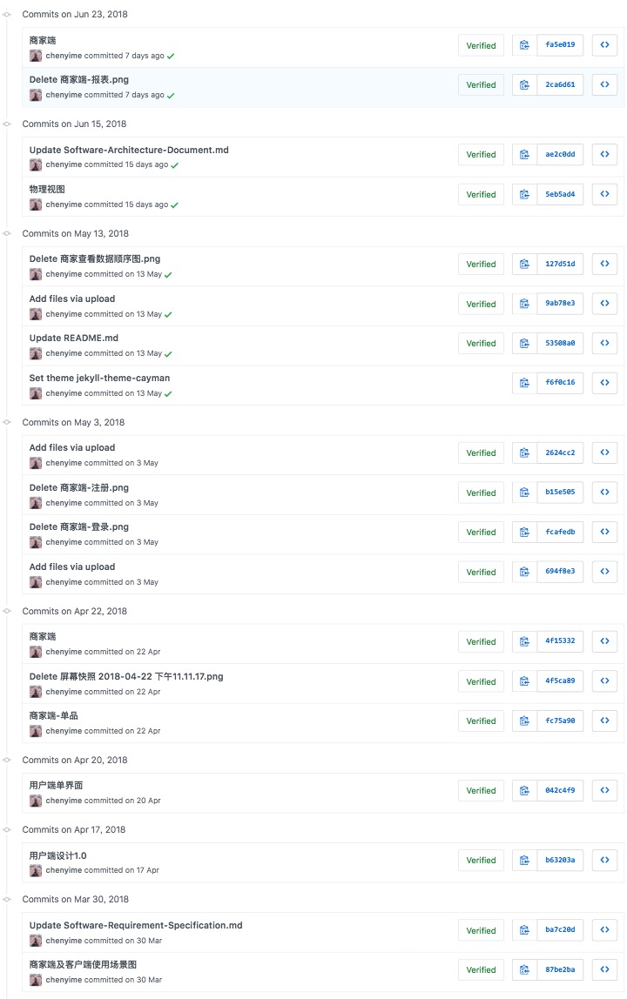
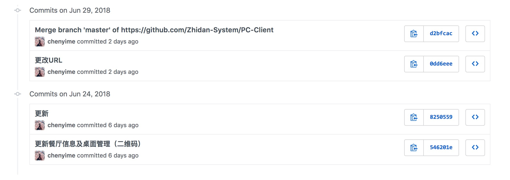
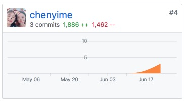

# Final Report

## 自我总结

通过这门课程，亲身参与了一个系统的分析、设计及开发的全过程，恰好有一些产品相关的经历，在这一门课程中学到的很多思维模式与产品需要具备的思维模式高度重合，不论是前期的原型交互设计，中期的与研发的排期沟通，还是后期的迭代优化，这些步骤与实际实习中都是高度一致的。而在这一门课中，我更加深刻体会到，产品并非一个虚无无法量化没有规律低门槛的工作，无论是前期梳理产品的功能结构与页面结构，设计良好的页面排布及交互流程，考虑一些特殊情况的处理，还是中期与研发的良好沟通，亦或是后期整理反馈迭代优化，都需要一套良好的设计模式支撑，也需要大量的经验积累。

最后十分感谢老师一学期的辛苦教学。

## PSP 2.1

### Inception

静态界面搭建

| Personal Software Process Stages | Time (%) |
|:----|:-----------:|
| **Planning** | **10** |
| - Estimate | 10 |
| **Development** | **87** |
| - Analysis | 20 |
| - Design Spec | 5 |
| - Design Review| 10 |
| - Coding Standard| 10 |
| - Design | 10 | 
| - Coding | 20 |
| - Code Review | 2 |
| - Test | 10 |
| **Reporting** | **3** |
| - Test Report | 0 |
| - Size Measurement | 1 |
| - Postmortem & Process Improvement Plan | 2 |

### Iteration1

API 接入

| Personal Software Process Stages | Time (%) |
|:----|:-----------:|
| **Planning** | **2** |
| - Estimate | 2 |
| **Development** | **90** |
| - Analysis | 10 |
| - Design Spec | 2 |
| - Design Review| 2 |
| - Coding Standard| 5 |
| - Design | 14 | 
| - Coding | 35 |
| - Code Review | 5 |
| - Test | 17 |
| **Reporting** | **8** |
| - Test Report | 2 |
| - Size Measurement | 4 |
| - Postmortem & Process Improvement Plan | 2 |

### Iteration2

交互优化

| Personal Software Process Stages | Time (%) |
|:----|:-----------:|
| **Planning** | **16** |
| - Estimate | 16 |
| **Development** | **75** |
| - Analysis | 10 |
| - Design Spec | 2 |
| - Design Review| 2 |
| - Coding Standard| 2 |
| - Design | 14 | 
| - Coding | 30 |
| - Code Review | 5 |
| - Test | 10 |
| **Reporting** | **9** |
| - Test Report | 1 |
| - Size Measurement | 4 |
| - Postmortem & Process Improvement Plan | 4 |

### 汇总表
 
| Personal Software Process Stages | Time (%) |
|:----|:-----------:|
| **Planning** | **6** |
| - Estimate | 6 |
| **Development** | **85** |
| - Analysis | 8 |
| - Design Spec | 4 |
| - Design Review| 2 |
| - Coding Standard| 6 |
| - Design | 14 | 
| - Coding | 32 |
| - Code Review | 4 |
| - Test | 15 |
| **Reporting** | **9** |
| - Test Report | 1 |
| - Size Measurement | 4 |
| - Postmortem & Process Improvement Plan | 4 |

## Github

[Zhidan-System/Dashboard](https://github.com/Zhidan-System/Dashboard/commits?author=chenyime)

[Zhidan-System/PC-Client](https://github.com/Zhidan-System/PC-Client/commits?author=chenyime)

## 工作清单

1. 负责了文档中部分图表内容的输出；参与了小组讨论，整理了项目的功能需求及应用场景。

2. 负责了产品的原型图、页面交互的设计以及特殊情况的处理，包括移动端（用户）界面及 PC 端（商家管理系统）。

3. 负责了商家管理系统中**餐桌管理**及**餐厅信息管理**两个模块的开发实现。

## 博客集合

https://chenyime.github.io

