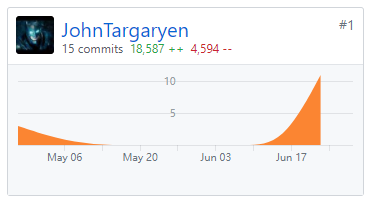
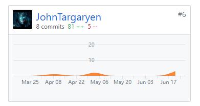

# 课程总结
1. 学习了Github协同开发的使用
2. 学习了前端开发框架VUE以及各种各样的组件库如element-ui、echarts
3. 亲身参与软件开发流程，更深刻地体会到了软件系统开发的过程
4. 获得了小组协同工作开发的经验

# PSP2.1
PSP2.1 | Personal Software Process Stages | 预估耗时（分钟）| 实际耗时（分钟）
---- | --- | --- | --- |
Estimate |  估计这个任务需要多少时间 | 740 | 670 |
Analysis | 需求分析 (包括学习新技术) | 120 | 90 |
Design Spec | 生成设计文档 | 60 | 30 |
Design Review | 设计复审 (和同事审核设计文档) | 30 | 45 |
Coding Standard | 代码规范 (为目前的开发制定合适的规范) | 10 | 20 |
Design | 具体设计 | 30 | 30 |
Coding | 具体编码 | 300 | 240 |
Code Review | 代码复审 | 60 | 90 |
Test | 测试（自我测试，修改代码，提交修改） | 60 | 60 |
Reporting | 报告 | 20 | 20 |
Test Report | 测试报告 | 20 | 20 |
Size Measurement | 计算工作量 | 10 | 10 |
Postmortem & Process Improvement Plan | 事后总结, 并提出过程改进计划 | 20 | 15 |

# Git统计报告

| 仓库                                                      | commit记录                                    |
| --------------------------------------------------------- | --------------------------------------------- |
| [PC-Client](https://github.com/Zhidan-System/PC-Client)   |    |
| [Dashboard](https://github.com/Zhidan-System/Dashboard)   |    |

# 工作说明

负责PC客户端前端页面路由搭建以及数据统计页面、订单页面的编写与调试

# 个人技术博客链接

- [MVC设计模式](https://blog.csdn.net/m18718300471/article/details/79926126)

- [VS优化选项](https://blog.csdn.net/m18718300471/article/details/79768361)

- [热更新架构](https://www.jianshu.com/p/d6da937b8b0f)

