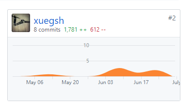
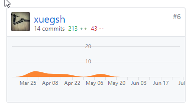

# Final Report

## 课程学习总结

通过对这门课程的学习以及此次点餐系统的开发，我不仅经历了使用迭代和增量式开发的方法进行软件开发的全过程，同时也深刻体会到了这种开发模式给我们带来的各种便利以及效率提升。项目中，通过编写各种项目文档以及对系统的各种建模，不仅提高了我们对开发产品的需求的认识，同时也减少了小组成员之间一些无谓的沟通，提高了开发的速度。

实际开发中，我也学习了使用vue框架进行前端开发，运用组件库提高开发效率。此外，也感受到了使用GitHub进行团队协同开发的便捷和高效。

## PSP 2.1 统计表

| 工作内容                   | Time    | Percent(%) |
| ---------------------- | ------- | ---------- |
| **计划**                 | **60**  | **6**      |
| - 估计这个任务需要多少时间         | 60      | 6          |
| **开发**                 | **840** | **73**     |
| - 分析需求                 | 120     | 12         |
| - 生成设计文档               | 60      | 6          |
| - 设计复审 (和同事审核设计文档)     | 60      | 6          |
| - 代码规范 (为目前的开发制定合适的规范) | 60      | 6          |
| - 具体设计                 | 360     | 36         |
| - 代码复审                 | 60      | 6          |
| - 测试（包括自我测试，修改代码，提交修改） | 120     | 12         |
| **记录时间花费**             | **30**  | **3**      |
| **测试报告**               | **60**  | **6**      |
| **计算工作量**              | **30**  | **3**      |
| **事后总结**               | **30**  | **3**      |
| **提出过程改进计划**           | **60**  | **6**      |

## 个人分支的 GIT 统计报告

| 仓库                                       | commit记录                                 |
| ---------------------------------------- | ---------------------------------------- |
| [PC-Client](https://github.com/Zhidan-System/PC-Client) |  |
| [Dashboard](https://github.com/Zhidan-System/Dashboard) |  |

## 工作清单

1. 完成PC商家端前端菜单页面、菜品分类页面的编写与调试，并与后端对接。
2. 完成部分用例以及product backlog等文档的编写

## 博客清单

[vue框架学习报告](https://blog.csdn.net/devin_xue/article/details/79951857)
