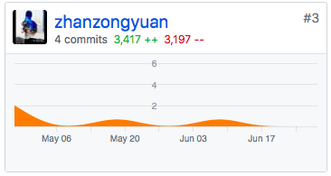
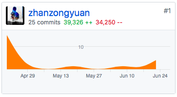
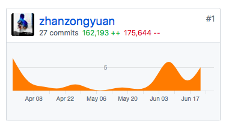
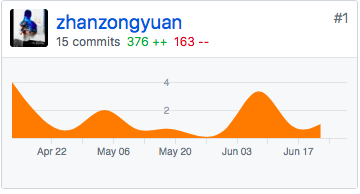
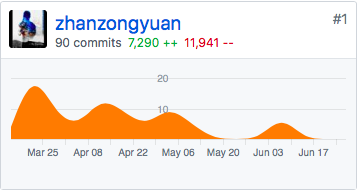

# Final Report

> 詹宗沅 15331386

## 1. 课程学习自我总结

>  下面从分析、设计、开发、管理四个方面进行课程学习自我总结：

​	需求分析是一个项目的最重要的部分，课程中我学习到使用UML图进行用例图的设计，用文字描述用例模型，进而分析用户的需求。通过这次大作业实践，我才体会到需求分析必须要求整个团队都对项目设计的需求清楚理解并肯定，这在前期至关重要。

​	在设计方面，我学习了领域建模、设计EER表、设计开发架构，领域建模是对用例涉及到的对象用用例图抽象的描述，也能为数据库ER表的设计提供借鉴。设计开发架构的过程中，使用的是MVC架构设计后端，使得代码结构清晰易于分工。结合实践，个人认为设计需要合理的分析可行性，适当按技术特性调整设计（比如交互设计、数据库设计等）。

​	开发方面，除了学习各种新技术外，这部分最大的困难在于如何把前面的分析设计的各种文档应用于开发过程，提供团队的效率。特别是大作业实践的过程，很多人不顾文档，直接开发，导致经常为了开发修改文档，这样很不合理，使得项目最终的完成度很低。

​	管理方面，学习看板的使用。

 

## 2. PSP 2.1 (People Software Process)统计表

| 工作内容                                   | 所需技能                                   | Time(week) | Percent(%) |
| ------------------------------------------ | ------------------------------------------ | ---------- | ---------- |
| **计划**                                   | -                                          | **1**      | **7**      |
| - 估计这个任务需要多少时间                 | 多年工作经验，对工作量的合理评估           | 1          | 7          |
| **开发**                                   | 基本编程能力                               | **7.5**    | **55**     |
| - 分析需求                                 | 明确用户需求能力                           | 2          | 15         |
| - 生成设计文档                             | 设计软件结构的能力，相关设计工具的使用能力 | 1          | 7          |
| - 设计复审 (和同事审核设计文档)            | 合作能力，软件设计规范                     | 0.5        | 4          |
| - 代码规范 (为目前的开发制定合适的规范)    | 契合团队开发代码风格                       | 0.5        | 4          |
| - 具体设计                                 | 编码能力                                   | 3          | 22         |
| - 代码复审                                 |                                            | 0.2        | 1          |
| - 测试（包括自我测试，修改代码，提交修改） | 测试工具的使用能力                         | 0.3        | 2          |
| **记录时间花费**                           |                                            | 0.5        | 4          |
| **测试报告**                               | 报告编写                                   | **1**      | **7**      |
| **计算工作量**                             |                                            | **1**      | **7**      |
| **事后总结**                               | 自我反省的能力                             | **1**      | **7**      |
| **提出过程改进计划**                       | 完善自我的能力                             | **1**      | **7**      |

 

## 3. 个人分支GIT统计报告

下面是本人在本次项目中的各个仓库内commit的记录报告

| 仓库                                                      | commit记录                                                   |
| --------------------------------------------------------- | ------------------------------------------------------------ |
| [PC-Client](https://github.com/Zhidan-System/PC-Client)   |  |
| [API](https://github.com/Zhidan-System/API)               |  |
| [Web-Server](https://github.com/Zhidan-System/Web-Server) |  |
| [Database](https://github.com/Zhidan-System/Database)     |  |
| [Dashboard](https://github.com/Zhidan-System/Dashboard)   |  |

 

## 4. 有价值的工作清单

- 搭建Nginx环境，实现Nginx反向代理nodejs服务器、代理静态文件服务
- 应用MVC结构搭建后端架构
- 应用promise于数据库连接池，实现数据库请求用promise链式回调
- 实现Redis管理用户Session信息
- 应用swagger编写API文档，同时使用Travis CI自动部署到github page
- 完成Restaurant、Menu、Session、Order四个主要类型的API的设计和编码工作
- 设计EER表
- 通过配置webpack实现前端的本地开发环境调试，同时解决了跨域问题，访问远程服务器

 

## 5. 博客清单

- [Web应用安全认证机制](http://blog.zhanzy.xyz/2018/05/08/Web应用安全认证机制/)
- [RESTful风格API理解以及设计](http://blog.zhanzy.xyz/2018/05/08/RESTful风格API理解以及设计/)
- [Session和Cookie](http://blog.zhanzy.xyz/2018/05/01/Session和Cookie/)
- [Nginx](http://blog.zhanzy.xyz/2018/05/01/Nginx/)