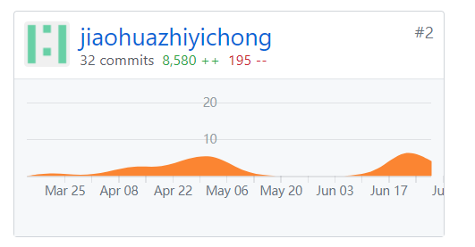
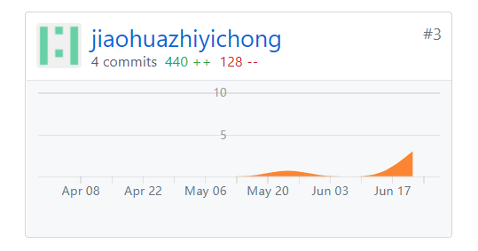

# 15331388 Final Report
## 课程学习总结

- 本次课程我学会如何以工程化科学系统地开发软件，使我对软件工程中关于敏捷开发有了一个更深的体会，更加深入细致地了解了其中的相关过程。
- 此次项目刚开始时我作为客户经理和后端开发工程师，前期作为客户经理做了大量的需求分析工作，在编写愿景文档和项目前期调研后对项目的规划有了一个大致的了解，随着课程的逐渐深入，我和队友慢慢完成了需求规格说明，完善了相关用例，逐渐明确了用户的操作，也逐渐明确了后续相关模型的建立。随着领域模型和数据库的构建，前端和后端同时开始了工作，我作为后端开发人员实现了相关API，因为以前没有从事过后端开发，这次的开发感觉还是积累了不少经验和体会，也获得了不少知识。
- 随着项目后续的进行，我接手了一些项目经理的工作，补充了功能模型和状态模型，还增加了相关设计规范，在这里特别感谢队里的其他六个同学，正是大家的愉快合作才有了我们项目的最终实现。

## PSP2.1统计表
|PSP 2.1 |PSP阶段 | 预估耗时 |  实际耗时| 
|:-------|:-------|:---------|:----------|
| Planning | 计划 | 60 | 50|
|Research | 前期规划 | 120 | 120 |
| Analysis | 需求分析 | 120 | 120 |
| Design Spec | 生成设计文档 | 120 | 130 |
| Design Review | 设计复审 | 120 | 120 |
| Coding Standard | 代码规范 | 120 | 120 |
| Design | 具体设计 | 120 | 120 |
| Coding | 具体编码 | 0 | 0 |
| Code Review | 代码复审 | 0 | 0 |
| Test | 测试 | 90 | 100 |
| Reporting | 报告 | 90 | 100 |
| Test Report | 测试报告 | 60 | 80 |
| Size Measurement | 计算工作量 | 30 | 30 |
| Postmortem & Process Improvement Plan | 事后总结，并提出过程改进计划	| 50 | 50 |
| | 合计 | 1000 | 1200 |

## 有价值的工作清单
- 完成后端statistics的工作
- 完成项目前期调研和愿景工作以及后续领域建模和状态建模

## GIT统计报告
- DashBoard

- web-server

## 博客链接
[Mysql相关查询](https://blog.csdn.net/zc2985716963/article/details/80869780)

[Express相关应用](https://blog.csdn.net/zc2985716963/article/details/79952630)
