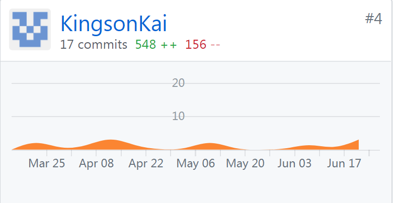
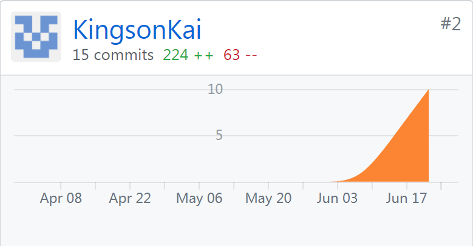

# 15331393 Final Report
## 课程学习总结

- 通过本课程学习，我懂得了工程化、科学化、系统化地开发软件，另外，我还对软件工程中关于敏捷开发有了更深的领悟。  
- 此次项目我作为技术经理和后台开发人员，深刻学习到了具体项目中的各个步骤以及团队的合作。  
- 特此此次感谢团队里的其他六位同学，是大家的愉快合作让我们最终实现了此次项目。  

## PSP2.1统计表
|PSP 2.1 |PSP阶段 | 预估耗时 |  实际耗时| 
|:-------|:-------|:---------|:----------|
| Planning | 计划 | 60 | 50|
|Research | 前期规划 | 120 | 120 |
| Analysis | 需求分析 | 120 | 120 |
| Design Spec | 生成设计文档 | 120 | 130 |
| Design Review | 设计复审 | 120 | 120 |
| Coding Standard | 代码规范 | 120 | 120 |
| Design | 具体设计 | 120 | 120 |
| Coding | 具体编码 | 0 | 0 |
| Code Review | 代码复审 | 0 | 0 |
| Test | 测试 | 90 | 100 |
| Reporting | 报告 | 90 | 100 |
| Test Report | 测试报告 | 60 | 80 |
| Size Measurement | 计算工作量 | 30 | 30 |
| Postmortem & Process Improvement Plan | 事后总结，并提出过程改进计划	| 50 | 50 |
| | 合计 | 1000 | 1200 |

## 有价值的工作清单
- 完成后端关于更新功能的api编写
- 完成关于k8s简介以及部署yaml文件编写与使用

## GIT统计报告  
DashBoard：  

web-server：  

## 博客链接
[nginx学习](https://blog.csdn.net/kingsonying/article/details/79949318)  

[项目管理与设计相关博客](https://blog.csdn.net/kingsonying/article/category/7508442)  

[python学习](https://blog.csdn.net/kingsonying/article/details/79658405)  

[matlab学习](https://blog.csdn.net/kingsonying/article/details/79156347)

[Lua学习](https://blog.csdn.net/kingsonying/article/details/79156117)